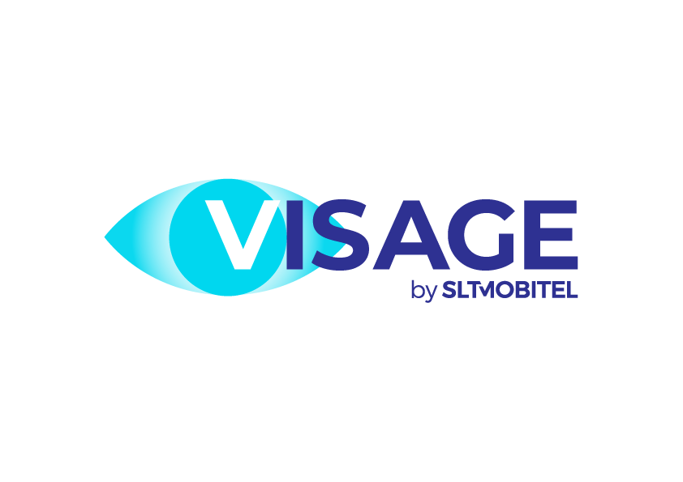
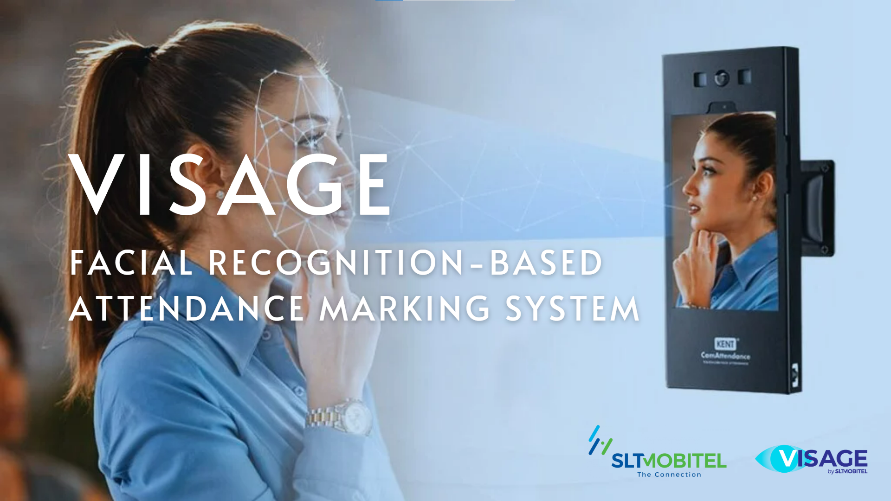
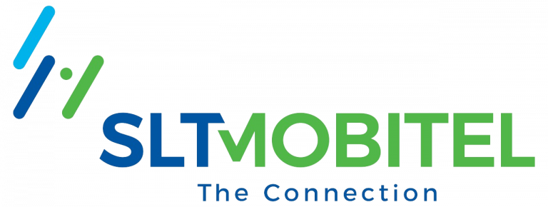

# Project Visage

## Smart Vision-Based Attendance Marking System

    

### Team Members
- Member 1
- Member 2
- Member 3
- Member 4

### Supervisor
- Dr. John Doe

### Institution
- XYZ University

### Date
- October 2023

---

    

---

### Abstract
Project Visage is an innovative smart vision-based attendance marking system designed to streamline and automate the process of recording attendance using advanced image processing techniques.

---

## Table of Contents
1. [Introduction](#introduction)
   - [Overview](#overview)
   - [Purpose](#purpose)
   - [Key Features](#key-features)
2. [System Architecture](#system-architecture)
   - [Backend Components](#backend-components)
   - [Frontend Components](#frontend-components)
   - [Hardware Components](#hardware-components)
3. [Mobile Application](#mobile-application)
4. [Hardware Setup](#hardware-setup)
5. [Technical Implementation](#technical-implementation)
6. [Use Cases](#use-cases)
7. [Future Enhancements](#future-enhancements)
8. [Conclusion](#conclusion)

## 1. Introduction

### Overview
Visage is a cutting-edge facial recognition-based attendance marking system designed to streamline and automate the process of tracking employee or intern attendance. It combines mobile app functionality with a robust hardware setup to provide a seamless experience for both remote and on-site users.

### Purpose
The primary purpose of Visage is to:
- Eliminate manual attendance marking processes
- Enhance security by ensuring only authorized individuals can mark attendance
- Provide real-time feedback to users through visual and audio cues
- Generate accurate attendance logs for administrative purposes

### Key Features
- **Facial Recognition**
  - Detects and verifies faces in real-time
  - Matches captured faces against a pre-registered database
- **Attendance Tracking**
  - Marks "In" and "Out" times for interns/employees
  - Logs attendance data for reporting and analysis
- **Spoof Detection**
  - Prevents unauthorized access attempts using photos, masks, or videos
- **Real-Time Feedback**
  - Provides visual (LED lights) and audio (speaker) feedback
- **Mobile App Integration**
  - Allows remote attendance marking via smartphone

[Continue with remaining sections...]

    

