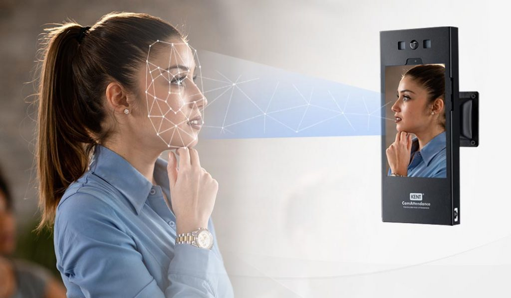

# Project Visage

## Smart Vision-Based Attendance Marking System

    

### Team Members
- Member 1
- Member 2
- Member 3
- Member 4

### Supervisor
- Dr. John Doe

### Institution
- XYZ University

### Date
- October 2023

---

    

---

### Abstract
Project Visage is an innovative smart vision-based attendance marking system designed to streamline and automate the process of recording attendance using advanced image processing techniques.

---

    

